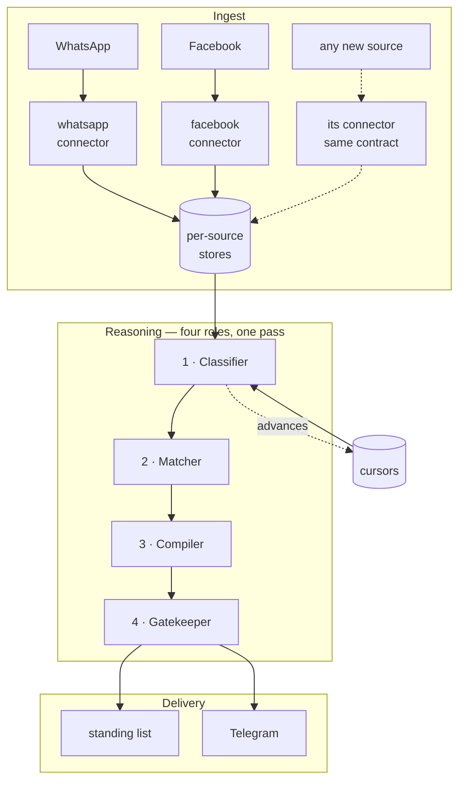
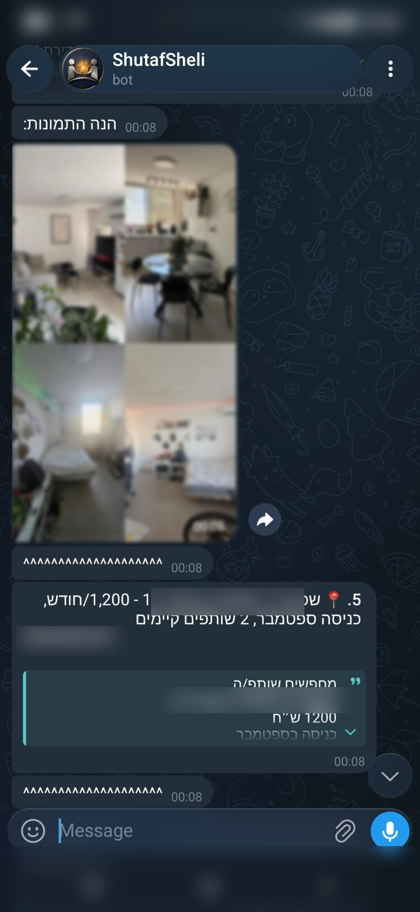
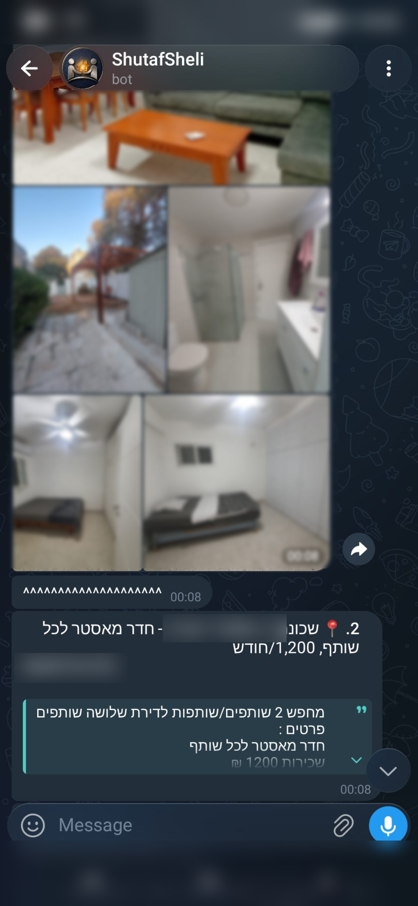

# Shutaf Sheli

**An automated pipeline that reads apartment listings out of group chats, decides which ones actually fit, and delivers the survivors to Telegram.**

I built it to solve my own problem: finding a room in a shared apartment near Ben-Gurion University — without opening a single one of those groups myself.

It runs across several sources at once — WhatsApp and Facebook today — and the architecture was shaped around exactly that. Each source is a self-contained connector whose only job is to write records into a store, and the reasoning layer reads all of them through a single source tag. Adding a new platform stays a small, contained job: write one connector, declare how its records are ordered, and the classification, matching, aging and delivery stages pick it up unchanged.

This page is a write-up of how the system is built and what broke along the way. The source is private — it holds live session credentials and the personal details of people posting in those groups — so this repository documents the architecture rather than shipping the code.

---

## The problem, without the tool

Apartment listings here don't live in one place. They're spread across a dozen WhatsApp and Facebook groups, each with its own crowd, its own volume, and its own posting rhythm — and the same apartment often appears in three of them, worded differently each time.

**That turns a search into a shift you have to work.** Good listings are gone within hours, so being subscribed isn't enough — you have to actually be *watching*, all day, across every group, or the ones worth having are taken before you open the app. Miss an evening and you've missed that evening's apartments. There's no catching up later, because there's no archive to catch up on: just a scroll that keeps moving.

And the ones you do catch are mostly not for you. Every group is a mix of whole apartments, sublets ending before you need one, listings that want a third-year student, listings looking specifically for a woman. Reading all of them is the price of finding the few that fit.

**Then there's the part nobody talks about: you can't compare any of it.** A listing says a street name. Is that a neighborhood you want to live in? How far is it from campus, from a gym, from anything you use? Nothing is sorted by price, nothing states distance, and every post is written in a different order by a different person. Comparing two apartments means opening a map, twice, and holding both in your head.

---

## What it changed

Before this, I was the pipeline: sitting in every group, forwarding listings to myself so they wouldn't scroll away, checking back through the day, re-reading the same posts because there was no way to mark what I'd already seen. Hours a day — and I still lost apartments to an evening I wasn't watching.

Now a run returns a short ranked list: only what fits in both directions, details already extracted, contact ready to tap, and everything I've already seen or that stopped fitting removed before I open it.

---

## Architecture



Connectors write into their own stores. The reasoning chain reads those stores, filtered by a per-group cursor, and produces one standing list.

The two halves are deliberately separate codebases. The connectors know nothing about apartments; the reasoning layer knows nothing about browser automation. That separation is what makes a new source cheap.

---

## What it produces

<p align="center">
  
  
</p>

Each surviving listing arrives as its own message: a numbered caption naming the neighborhood and rent, the photos the poster attached, the contact on its own line so it is one tap on a phone, and the poster's full original text collapsed underneath — one tap away when the summary isn't enough, out of the way when it is. A separator closes each listing, so a batch of eight stays readable on a phone screen.

*Street names and phone numbers are blurred.*

---

## How each stage works

**Ingest.** Connectors run per source and exit on their own — nothing sits running in the background. Scraping stops on a heuristic rather than a fixed page count: the collector scrolls until it hits a run of consecutive posts it has already stored, which it treats as reaching known territory and stops. Independent hard caps — scroll count, post count, and wall-clock seconds — always run alongside it, because on a first pass there is no known territory to find, and something has to bound the session. Scroll timing is randomized rather than machine-uniform.

**1 · Classifier.** Turns raw messages into structured rows: neighborhood, address, price, room type, amenities, distance, move-in date, contact, existing-roommate status. It labels each message *Listing*, *Uncertain*, or *Not a listing*, and keeps the full original text verbatim alongside the extracted fields, because the person reading the final list wants to hear the poster's actual tone.

**2 · Matcher.** Runs the fit check in both directions (see below). Every listing it rules out is recorded with the specific rule that ruled it out, so a filter making bad calls shows up instead of staying silent.

**3 · Compiler.** Places survivors into three age categories and enforces the aging rules.

**4 · Gatekeeper.** Audits the other three: re-checks the include/exclude calls, verifies the category arithmetic, confirms every delivered listing carries full contact details, and confirms that a run with zero new matches says so explicitly instead of quietly shipping a short list.

---

## Design decisions

**A cursor, not a "seen" list.** Each group stores a single line recording how far the pipeline has already read:

```
[group id] | 1787509258 | a1b2c3d4e5 | 2026-08-24
```

The group, the position of the last message already processed, that message's ID, and when the run happened. The next run reads only what comes after that position; everything at or before it is skipped without being opened at all. This replaced a seen-list that grew without bound and had to be searched on every message.

What the cursor removes is the cross-run question "have I already handled this particular message?" — now answered by position rather than by lookup, so it costs nothing and cannot drift out of sync.

What it deliberately does **not** remove is deduplication, which is a different problem and still a real job. The same apartment gets posted twice by the same person a week apart, or cross-posted to two groups, sometimes reworded enough that only the price and the street line up. Those duplicates are caught downstream, on the extracted listings, where the comparison is between apartments rather than between messages. Two identical captures of one message are caught earlier still, on the message ID, at the point of storage. Three different questions, three different places to answer them.

The two sources also need two different cursor anchors, which turned out to matter (see challenge 3).

**Aging with a hard cap.** A surviving listing is category 1 on its first run, 2 on the next, 3 on the one after, then it is gone — shown once under "removed," then dropped. Without the cap, a standing list slowly fills with apartments that were rented weeks ago. There is also a *freeze* switch: some rounds are worth letting ride — a run can re-check every carried listing against current criteria without advancing anyone's category, so the list stays current without the clock running on it.

**Nothing survives on inertia.** Carried-forward listings get the full check again on every run, not a reused verdict. Criteria change between runs — a new budget, a new hard exclusion — and re-checking is the only way to catch a listing that stopped fitting.

**One file, rebuilt.** The output is a single standing list at a fixed path, overwritten every run, rather than a new timestamped folder each time. A tool I run daily should not produce a directory I have to garbage-collect.

---

## Two sources, two record shapes

Every captured item is stored as a flat record, keyed by group. The two sources produce deliberately different shapes, and those differences are the reason the pipeline tags records by source instead of normalizing them into one.

**WhatsApp**

| Field | Notes |
|---|---|
| `ts` | Real message timestamp. The cursor anchor for this source. |
| `msgId` | Primary deduplication key. |
| `senderJid` | Raw sender identifier. Decides whether a phone number is recoverable at all — see challenge 2. |
| `phone` | Present only when resolvable, and never trustworthy on its own. |
| `name` | Display name. The fallback contact when no number exists. |
| `text` | Message body, verbatim. |
| `imagePath` | Local path to a downloaded image, or null. Not linked to any listing yet — see challenge 5. |
| `fromMe` | Whether the account itself sent it. |

**Facebook**

| Field | Notes |
|---|---|
| `scrapedAt` | Capture time, from the connector's own clock. The cursor anchor for this source — see challenge 3. |
| `tsRaw` | Facebook's relative time string, kept for humans only, never used for ordering. |
| `postId` | Primary deduplication key. |
| `permalink` | Always captured. The only reliable contact path on this source. |
| `name` | Often an auto-generated pseudonym rather than a real name. |
| `text` | Post body, after comment stripping — see challenge 1. |
| `imagePath` | Attached at scrape time from the post's own element, so it needs none of WhatsApp's association guesswork. |

There is no `phone` and no `senderJid` on the Facebook side, because Facebook exposes neither. A phone number exists there only if the poster typed one into the text. That single asymmetry is why the contact line is assembled per source instead of by one shared rule.

---

## Engineering challenges

### 1. The phone number that belonged to the wrong person

The first live Facebook run scraped 222 posts across seven groups with no errors. It also quietly corrupted some of them.

Facebook's DOM sometimes includes the comments below a post inside the same article node. Those comments were being swallowed into the post's own text — and in at least one case that meant a commenter's phone number was captured as the landlord's contact details. Nothing failed, nothing was logged, and the output would have had me calling a stranger about an apartment they don't own.

The fix cuts the text at boundaries observed in the real DOM, and strips a duplicated header that the same failure pasted at the start of the post. It was then applied retroactively to everything already stored: 112 posts cleaned of comment contamination, another 33 of trailing like and comment counts, and zero posts left empty by the cleanup.

What I took from it: "ran without errors" and "produced correct data" are separate claims, and only one of them was being checked.

### 2. The number that looks like a phone number and isn't

WhatsApp doesn't expose real phone numbers for senders who aren't saved contacts. It shows an opaque per-group identifier instead — a long numeric string that looks exactly like a phone number if you aren't paying attention, and dials nothing.

So extraction keys on the sender's raw identifier rather than on whether the field looks populated. Identifiers of one kind carry the real number and can be used; identifiers of the other kind must never be read as a phone number, because for those senders no recoverable number exists at all. When there is none, the system says so and falls back to the sender's display name, instead of writing down ten confident digits that don't connect to anyone.

### 3. Facebook has no clock

A cursor needs a reliable ordering key. WhatsApp gives a real per-message timestamp, so that side was straightforward.

Facebook's DOM exposes only relative time — "3 hours ago" — which can't anchor anything, because the same post reports a different age every time the page is rendered.

The fix was to stop reading Facebook's time and record my own instead: a capture timestamp written by the connector at scrape time, from a clock I control. Facebook's relative string is still stored, but only as context for a human — never as an ordering key. The two sources now run on two different anchors, documented as two separate sections of the cursor file so nobody later "simplifies" them into one.

### 4. The fix that disappeared every time the project was installed

The WhatsApp library's published version is broken against current WhatsApp: the service renamed a field the library depends on, and every attempt to read chats fails with a two-character error message that says nothing about why. The only working fix anywhere was in a community fork that had never been merged.

Applying it by hand works — you edit the library's file inside the project's dependency folder, and everything runs. The trap is that this folder is generated, not written: it's rebuilt from scratch whenever dependencies are installed. So the fix survives on the machine where it was applied, and silently vanishes the moment the project is set up anywhere else, reappearing as the same meaningless error on a machine where nothing seems different.

The fix now lives in the repository as a patch file, applied automatically as part of installation, with the library's version pinned exactly. If that version ever changes, the patch refuses to apply and says so loudly — a patch that quietly lands on the wrong version is worse than no patch at all.

### 5. The image matching that broke down as the backlog grew

WhatsApp doesn't deliver a photo album as one message. Each photo arrives as its own entry, with nothing linking it back to the listing text it belongs to. Rebuilding that link is a judgment call: photos from the same sender, in the same group, within a few minutes of the listing, belong to that listing.

The rule works. What broke was how it was being applied. After a twelve-day gap the backlog was 1,779 messages and 1,728 photos, and pairing them was done as a quick visual sweep instead of an actual check — it missed photos on 24 of the 30 surviving listings, including one whose eight photos were posted seconds apart by the same sender.

The mistake was the direction of the work. Walking the photos and asking "which listing owns this one?" means doing 1,728 pieces of work, and it grows every time the gap between runs grows. Walking the survivors instead — take each of the ~30 matched listings, then look up that sender and group among the photos — means doing 30 pieces of work, and that number barely moves no matter how big the backlog is. Same rule, same result, and it stopped being expensive enough to be tempted to shortcut.

### 6. Gender lives in the grammar, not in a keyword

A listing that specifies who it's looking for usually doesn't say so outright. In Hebrew the constraint is carried by the noun's grammatical gender.

`מחפשים שותפה` looks gender-neutral if you read the verb — `מחפשים` is masculine or mixed plural. The restriction is in the noun: `שותפה` is specifically a female roommate. Meanwhile `סטודנטיות מחפשות` is feminine throughout, but that describes *the posters*, not who they're looking for, and rules out nothing.

So the matcher reads the target noun rather than the surrounding conjugation, and treats combined forms — `שותף או שותפה`, `שותפ.ה` — as no restriction, so it doesn't over-exclude in the other direction. Keyword matching on the obvious phrases would have missed most real cases and invented several that weren't there.

### 7. Any script that connects drains the queue

WhatsApp hands over the messages accumulated since the last disconnect to whichever process connects, as part of the connection handshake, at the library level — before application code gets a say.

The consequence is counterintuitive: running a small unrelated utility that happens to connect will consume messages that were on their way to the collector, and mark them delivered. They're then gone permanently, with nothing having failed. Two connections sharing one session are worse — that invalidates the session and forces a fresh sign-in.

Both are operational rules rather than things the code can enforce: check for a live process before connecting, and never run a second connecting script while a collection run might be in flight.

---

## Bidirectional matching

Most matching systems check one direction. This one checks two, because in this market both sides filter.

**Does the apartment fit me?** Budget, neighborhood or walking distance, total occupancy, room type, availability window. Some rules are less obvious than they look: the apartment must already have at least one roommate in place, because a whole empty unit means assembling a group from scratch — a different problem with a different answer, even when the per-person price fits.

**Do I fit the apartment?** Any stated year-of-study floor above mine disqualifies me, including one phrased as a soft preference rather than a hard requirement — treating "preference" as negotiable produced matches that went nowhere. Plus the gender constraint from challenge 6.

Every exclusion is recorded with the rule that caused it — not "no match," but "requires second year and up, I'm starting first" or "₪1,400 against a ceiling of ₪1,200." That's what keeps the filter reviewable: when something good gets dropped, the record says which rule dropped it, so the rule can be corrected instead of guessed at. A filter that only ever says "no" teaches you nothing about whether it is right.

---

## Tech stack

| Layer | Choice | Why |
|---|---|---|
| WhatsApp ingest | Node.js, browser automation against the official web client | Reimplementing the protocol was tried first and abandoned — see below |
| Facebook ingest | Node.js, Playwright, real Chrome channel | No API exists for group members; read-only, on demand, with safety caps |
| Storage | Local JSON stores, keyed by group, deduplicated on message ID | The dataset is small and single-user; a database would be ceremony |
| Reasoning | LLM agent chain, four roles, each with its own spec and quality bar | The input is unstructured natural language; this is the part that isn't rules |
| Delivery | Telegram Bot API | Official, sends images natively, and carries none of the automation risk the WhatsApp path does |

**On the WhatsApp choice.** The first implementation used a library that reimplements the WhatsApp protocol directly. It hit a server-side bug that rejected new device registration outright — unfixable from my side, and it blocked the project entirely. Manual linking through the official web client kept working the whole time, which was the actual clue: instead of reimplementing the protocol, drive the client that already speaks it. Slower and heavier, and it has worked since.

---

## Status and what's next

- **Runs on a command, or on a schedule** — whichever suits the week. Either way nothing sits running in the background: a run starts, collects, delivers, and exits, so there is no process to keep alive and no account activity when nobody is looking.
- **The Facebook connector automates a real logged-in account,** which is against Facebook's terms of service and carries a real risk of account restriction. That was a deliberate, documented decision made before any code was written, and the mitigations are structural rather than cosmetic: read-only access, no posting or reacting of any kind, randomized scroll timing instead of machine-uniform intervals, and the stopping heuristic above, which ends a visit as soon as it recognizes posts it already has. Together those keep every session short, irregular, and shaped like someone reading a group rather than a crawler walking its full history — which is the difference automated-traffic detection is actually looking for.
